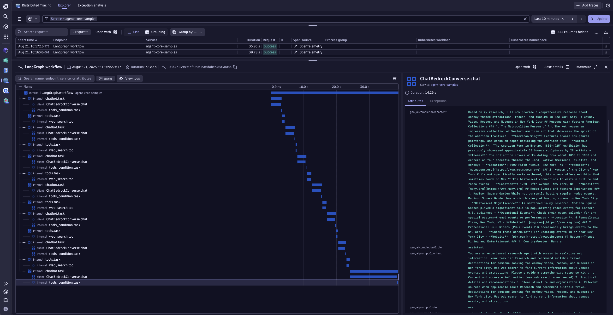

# Amazon Bedrock Agent Integration with Dynatrace

This example contains a demo of a Personal Assistant Agent built on top of [Bedrock AgentCore Agents](https://docs.aws.amazon.com/bedrock-agentcore/latest/devguide/what-is-bedrock-agentcore.html).



## Prerequisites

- Python 3.9 or higher
- Dynatrace Account
- AWS Account with appropriate permissions
- Access to the following AWS services:
   - Amazon Bedrock


## Dynatrace Instrumentation

> [!TIP]
> For detailed setup instructions, configuration options, and advanced use cases, please refer to the [Get Started Docs](https://docs.dynatrace.com/docs/shortlink/ai-ml-get-started).

Bedrock AgentCore comes with [Observability](https://docs.aws.amazon.com/bedrock-agentcore/latest/devguide/observability.html) support out-of-the-box.
Hence, we just need to register an [OpenTelemetry SDK](https://github.com/open-telemetry/opentelemetry-specification/blob/main/specification/overview.md#sdk) to send the data to Dynatrace AI Observability.

We simplified this process, hiding all the complexity inside [dynatrace.py](./dynatrace.py).
For sending data to your Dynatrace tenant, you can configure the `OTEL_ENDPOINT` env var with your Dynatrace URL for ingesting [OTLP](https://docs.dynatrace.com/docs/shortlink/otel-getstarted-otlpexport), for example: `https://wkf10640.live.dynatrace.com/api/v2/otlp`.

The API access token will be read from your filesystem under `/etc/secrets/dynatrace_otel`. 


## How to use

### Setting your AWS keys

Follow the [Amazon Bedrock AgentCore documentation](https://docs.aws.amazon.com/bedrock-agentcore/latest/devguide/runtime-permissions.html) to configure your AWS Role with the correct policies.
Afterwards, you can set your AWS keys in your environment variables by running the following command in your terminal:


```bash
export AWS_ACCESS_KEY_ID==your_api_key
export AWS_SECRET_ACCESS_KEY==your_secret_key
export AWS_REGION=your_region
```

Ensure your account has access to the model `eu.anthropic.claude-3-7-sonnet-20250219-v1:0` used in this example. Please, refer to the
[Amazon Bedrock documentation](https://docs.aws.amazon.com/bedrock/latest/userguide/model-access-permissions.html) to see how to enable access to the model.
You can change the model used by configuring the environment variable `BEDROCK_MODEL_ID`.


### Run the app

`uv run main.py`